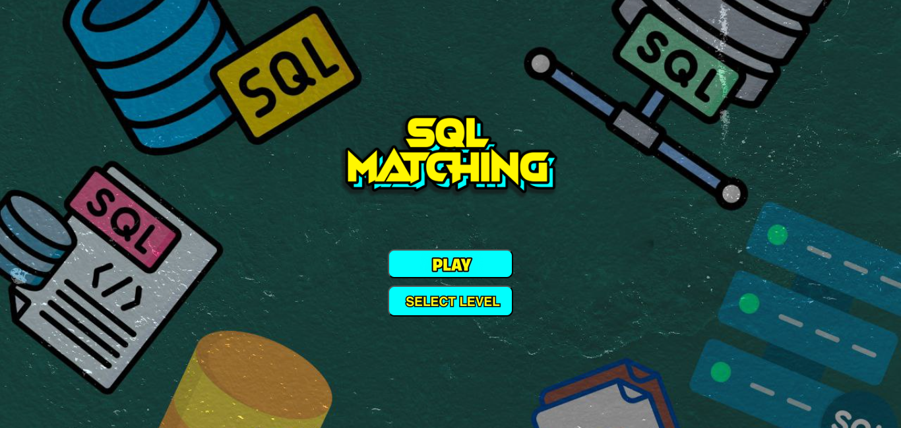
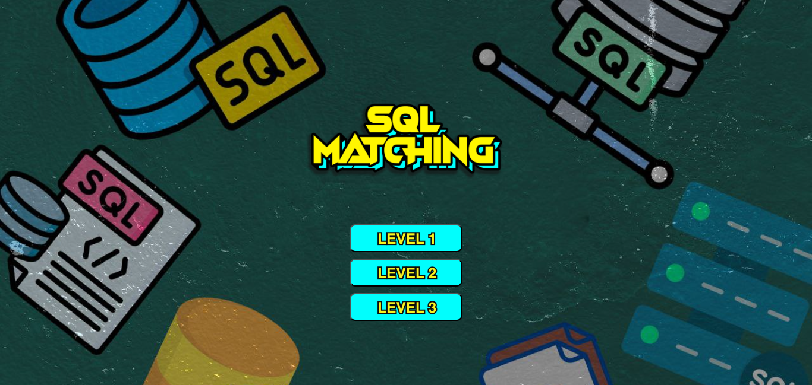
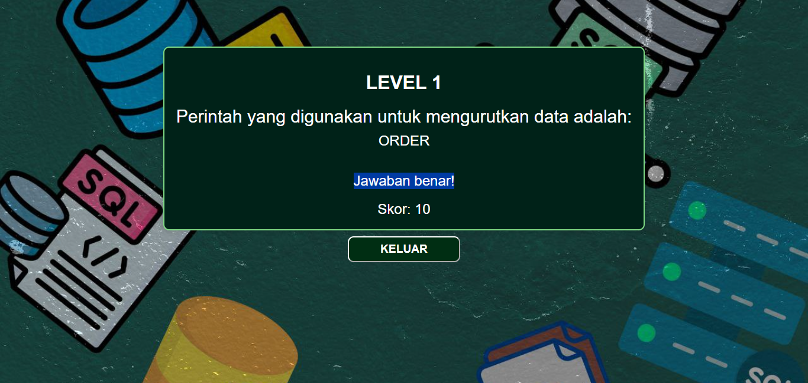
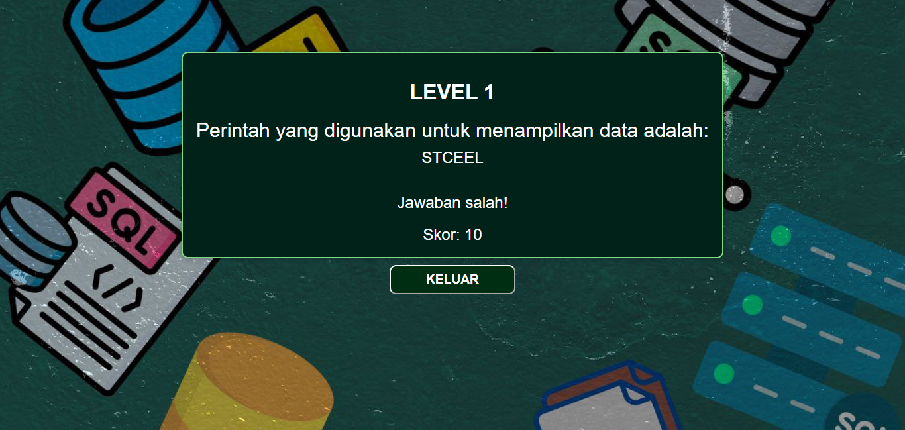
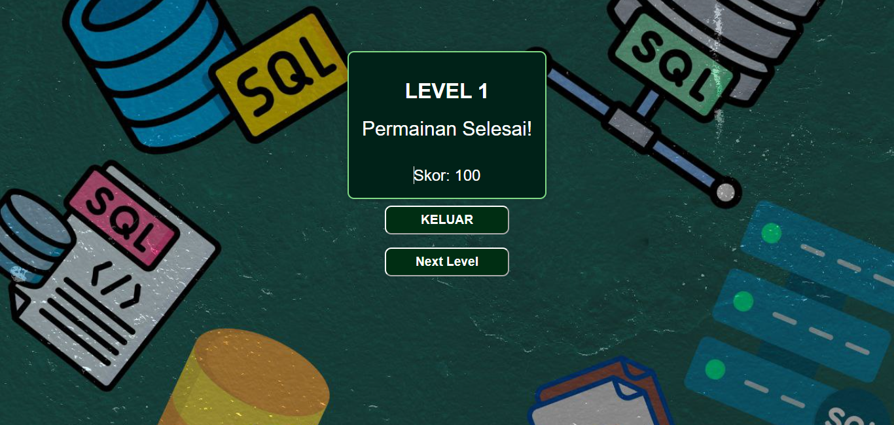

# gameweb

[Main Game Page](https://22091397005muhammadainurrofik.github.io/gameweb/bggame.html)

## Deskripsi Game "Matching String"

**Platform:** Web (HTML, CSS, JavaScript)

### Deskripsi Singkat
"Matching String" adalah sebuah permainan web interaktif yang menguji keterampilan pemain dalam menyusun ulang huruf-huruf yang teracak menjadi kata yang benar. Game ini dirancang menggunakan teknologi HTML, CSS, dan JavaScript untuk menciptakan pengalaman bermain yang sederhana namun menantang.

### Cara Bermain

1. **Memulai Permainan:**
   - Saat pemain memulai permainan, mereka akan disambut dengan tampilan awal yang menarik.
   - Pemain bisa memulai permainan dengan menekan tombol "Mulai" (Start).

2. **Mendapatkan Soal:**
   - Setelah permainan dimulai, pemain akan diberikan sebuah soal berupa pertanyaan. Contoh soal: "Perintah yang digunakan untuk mengurutkan data adalah".
   - Soal tersebut akan ditampilkan di atas kotak-kotak huruf yang telah diacak.

3. **Menyusun Kotak:**
   - Pemain diminta untuk mengklik kotak-kotak huruf yang telah diacak untuk mengatur ulang huruf-huruf tersebut menjadi jawaban yang benar.
   - Pemain harus mengatur kotak-kotak tersebut dengan urutan yang tepat untuk membentuk kata yang benar. Dalam contoh soal di atas, jawabannya adalah "ORDER".

4. **Menyelesaikan Permainan:**
   - Permainan akan secara otomatis memeriksa jawaban pemain setelah setiap langkah.
   - Jika urutan huruf pada kotak membentuk kata yang benar, pemain akan diberikan notifikasi bahwa mereka telah menyelesaikan soal tersebut dan dapat melanjutkan ke soal berikutnya.

### Teknologi yang Digunakan
1. **HTML:** Digunakan untuk membangun struktur dasar halaman web, seperti elemen-elemen permainan, tombol, dan tampilan hasil.
2. **CSS:** Digunakan untuk memberikan gaya pada permainan, termasuk tata letak, warna, animasi, dan responsivitas tampilan.
3. **JavaScript:** Digunakan untuk mengimplementasikan logika permainan, interaksi pengguna, pengacakan huruf, dan validasi jawaban secara otomatis.

### Tujuan Permainan
"Matching String" tidak hanya menghibur, tetapi juga membantu pemain meningkatkan keterampilan bahasa, kemampuan memecahkan masalah, dan ketelitian. Dengan tampilan yang menarik dan tantangan yang terus meningkat, permainan ini cocok untuk segala usia dan dapat dimainkan kapan saja secara online.

## Tampilan Game

### TAMPILAN BACKGROUND GAME

### TAMPILAN SELECT LEVEL

### TAMPILAN JAWABAN BENAR

### TAMPILAN JAWABAN SALAH

### TAMPILAN GAME SELESAI

